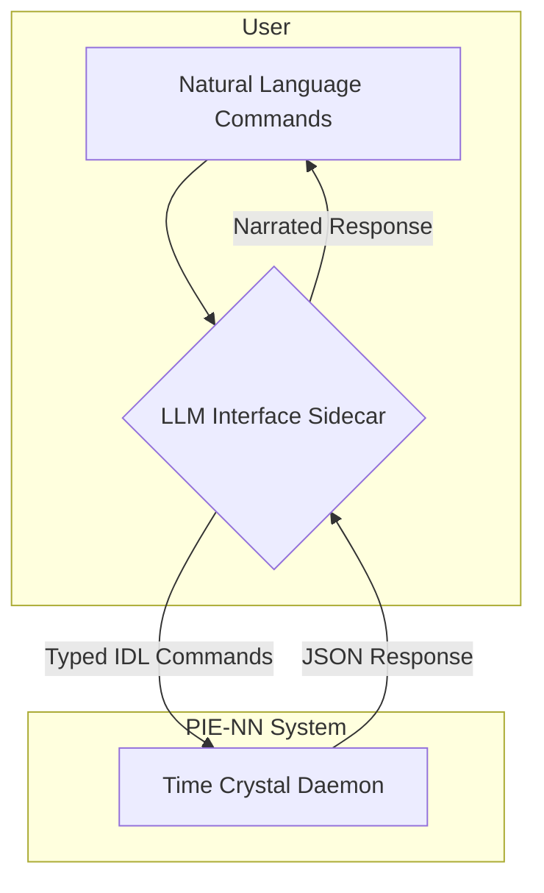
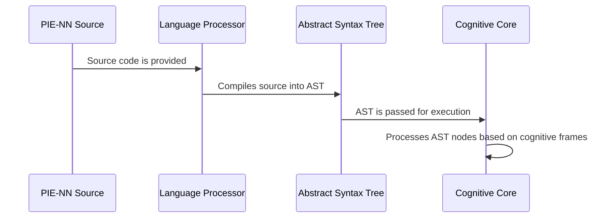

'''
# PIE-NN Technical Architecture

## 1. System Overview

The PIE-NN system is a cognitive architecture composed of two primary components: a deterministic **Time Crystal Daemon** that serves as the core runtime, and an **LLM Interface Sidecar** that acts as a natural language compiler. This separation ensures that all core cognitive and language processing is deterministic and verifiable, while still allowing for flexible interaction through natural language.



## 2. Time Crystal Daemon Architecture

The daemon itself is a multi-layered system that combines the `neuro-nn` cognitive model with the `time-crystal-daemon` execution model.

```mermaid
graph TD
    subgraph "Time Crystal Daemon"
        D[Socket Interface] --> E{Command Handler};
        E --> F[Cognitive Core (neuro-nn)];
        F --> G[PIE-NN Language Processor];
        G -- "Executes on" --> H[Time Crystal Hierarchy];
    end
```

- **Socket Interface**: Receives typed IDL commands from the LLM sidecar.
- **Command Handler**: Decodes commands and routes them to the appropriate subsystem.
- **Cognitive Core (neuro-nn)**: A simulation of a self-aware cognitive model that processes commands through multiple analytical frames (e.g., play, strategy, chaos) modulated by a set of personality parameters.
- **PIE-NN Language Processor**: The core interpreter for the PIE-NN language. It parses and executes PIE-NN source code.
- **Time Crystal Hierarchy**: A 12-level temporal oscillator that governs the execution timing of all processes within the daemon, ensuring deterministic, rhythmic operation.

## 3. Data Flow: From Language to Execution

The core data flow involves the compilation of PIE-NN source code into an Abstract Syntax Tree (AST), which is then executed by the cognitive core.



## 4. Integration Boundaries

The primary integration boundary is the UNIX socket between the LLM sidecar and the Time Crystal Daemon. All communication across this boundary is strictly defined by the Interface Definition Language (IDL).

- **Input**: JSON-formatted IDL commands.
- **Output**: JSON-formatted responses.

This ensures a clean separation of concerns and allows the LLM interface to be swapped or updated without affecting the deterministic core.
'''
